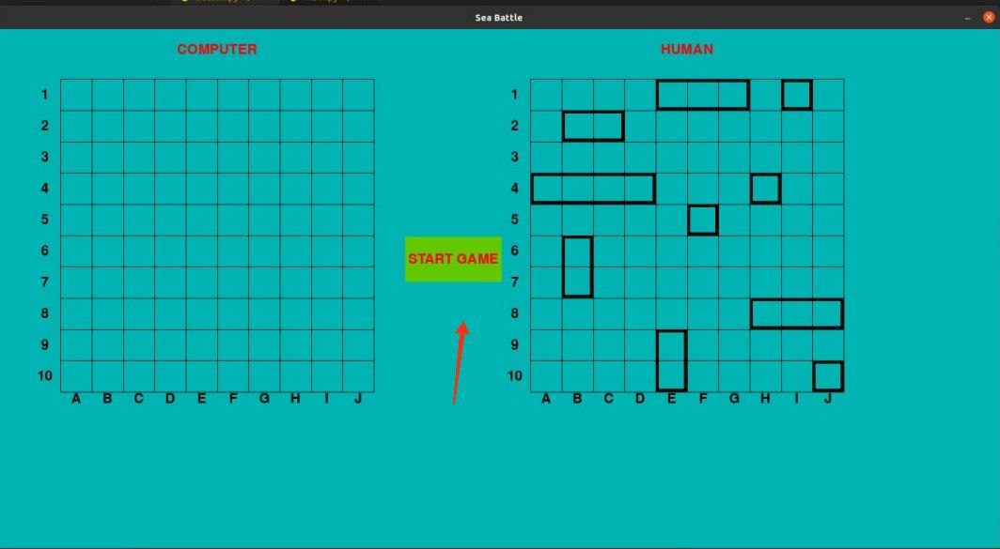
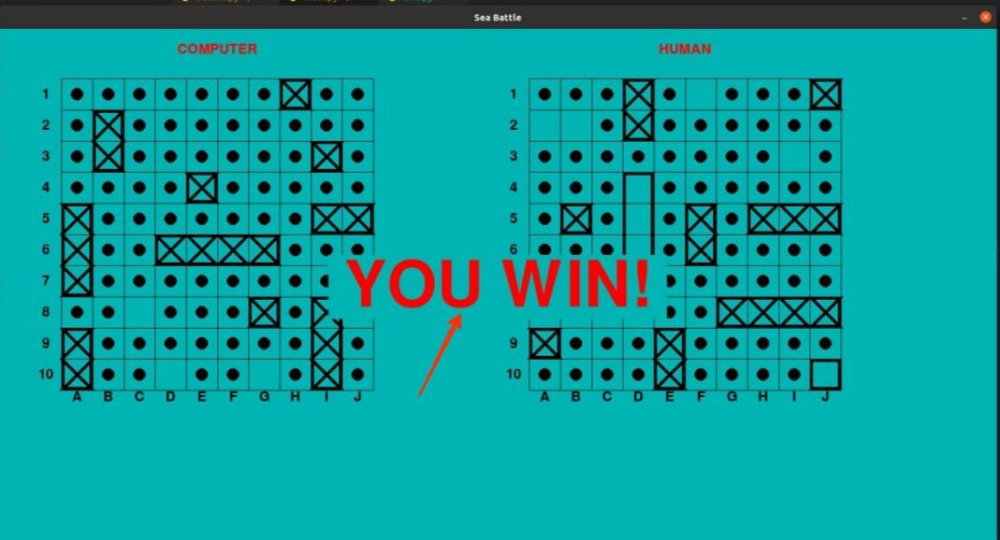

# [Mорской Бой](<https://ru.wikipedia.org/wiki/%D0%9C%D0%BE%D1%80%D1%81%D0%BA%D0%BE%D0%B9_%D0%B1%D0%BE%D0%B9_(%D0%B8%D0%B3%D1%80%D0%B0)>)

На выбор: графический и консольный интерфейс

Основа проекта в 13 файлах:

- **[main.py](main.py)** - главный файл
- **[console_interface.py](src%2Fconsole%2Fconsole_interface.py)** - файл с функцией реализующей консольный интерфейс
- **[print_board.py](src%2Fconsole%2Fprint_board.py)** - файл с функциями для разного вида вывода игрового поля в консоль
- **[message_functions.py](src%2Fconsole%2Fmessage_functions.py)** - файл с функциями для контакта с пользователем
- **[button.py](src%2FGUI%2Fbutton.py)** - файл с классом для отображения кнопок в графическом интерфейсе
- **[grid_class.py](src%2FGUI%2Fgrid_class.py)** - файл с классом для отображения игровой сетки в графическом интерфейсе
- **[gui_drawer.py](src%2FGUI%2Fgui_drawer.py)** - файл с классом для отображения графических деталей
- **[gui_interface.py](src%2FGUI%2Fgui_interface.py)** - файл с функцией реализующей графический интерфейс
- **[computer.py](src%2Fmodules%2Fcomputer.py)** - файл с реализацией класса для управления компьютером
- **[human.py](src%2Fmodules%2Fhuman.py))** - файл с реализацией класса для управления человеком
- **[player_class.py](src%2Fmodules%2Fplayer_class.py)** - файл с реализацией виртуального класса Player
- **[ship_manager.py](src%2Fmodules%2Fship_manager.py)** - файл с реализацией класса для управления кораблями
- **[global_variables.py](src%2Fglobal_variables.py)** - файл с глобальными и константными значениями 
 
  Используются библиотеки [pygame](https://www.pygame.org/docs/), [random](https://docs.python.org/3/library/random.html), [copy](https://docs.python.org/3/library/copy.html), [asyncio](https://docs.python.org/3/library/asyncio.html)

---

**Запуск игры:**

Сначала клонируйте репозиторий

---

    git clone https://github.com/asliddin03/TP_Sea_Battle.git

Установите нужные библиотеки

---

    pip install -r requirements.txt

Запуск

---

    python3 main.py

---
# Графический интерфейс

Игра запускается нажатием кнопки **START GAME**,

---

# Консольный интерфейс

Есть выбор между горизонтальным и вертикальным отображением.

Корабли автоматически размещаются системой на карте случайным образом.

---

Противником для игрока является бот.
Размещаются 4 типа кораблей:

- 1 корабль — ряд из 4 клеток («четырёхпалубный»)
- 2 корабля — ряд из 3 клеток («трёхпалубные»)
- 3 корабля — ряд из 2 клеток («двухпалубные»)
- 4 корабля — 1 клетка («однопалубные»)
  **По окончание игры объявляется победитель.**
  

__Нужные команды для клонирования репозитория и установки необходимых файлов__
***
    git clone git@gitlab.akhcheck.ru:Aminov_Sh/TP_Sea_Battle.git
    pip install -r requirements.txt

__Установка python и дополнительного пакета__
***
    sudo apt update
    sudo apt install python3.8
    sudo apt install -y python3-pip
__Переходите в папку src__
***
    cd src
__Запуск:__
***
    python3 main.py
